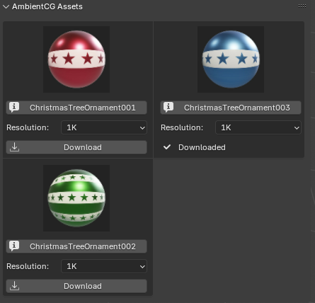
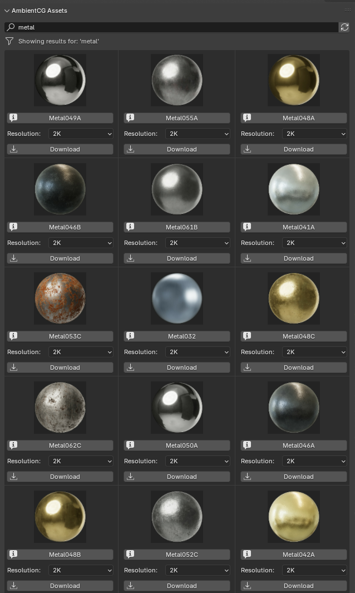

# AmbientCG Blender Addon

---
## CREDITS

> https://github.com/ninofiliu/blender-ambientcg-addon for the downloading and making material part :))

---

The **AmbientCG Addon** integrates an asset browser into Blender, allowing users to browse and import assets from AmbientCG.

---

## 📸 Preview

---

## 🔨 Building the Addon
To build this addon, a script named `zip.py` is used to package the source folder (`ambientcg-addon`) into a `.zip` file that can be installed in Blender.

### Steps:
1. Run `zip.py` to create the addon package.
2. Install the generated `.zip` file in Blender via **Edit → Preferences → Add-ons → Install...**
